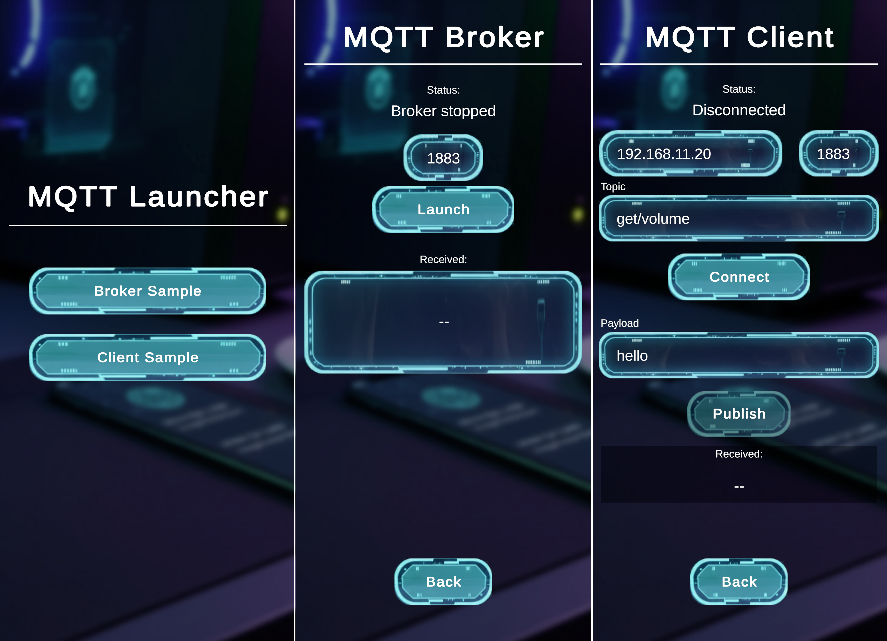

# Unity MQTT Sample

Unity で MQTT を扱うための学習用サンプルです。MQTTnet を用いた「クライアント」（接続/購読/発行）と、「組み込みブローカー（MQTT サーバ）」の双方を確認できます。ライブラリは `Assets/Packages/MQTTnet.3.1.2` に同梱されています。

## 前提条件
- 外部ブローカーを使う場合は、事前に起動しておきます（例: Mosquitto）。
- デフォルト値: `host: localhost`、`port: 1883`、`topic: send/hello`、`payload: hello`

## シーン構成
- `Assets/Project/Scenes/Launcher.unity`: サンプル起動用ランチャー。
- `Assets/Project/Scenes/ClientSample.unity`: MQTT クライアントサンプル（`MqttClientSample`）。
- `Assets/Project/Scenes/BrokerSample.unity`: 組み込みブローカーサンプル（`MqttBrokerSample`）。

## クイックスタート
1) Unity でプロジェクトを開き、`Launcher.unity` を再生します。
2) 以下のいずれかを選びます。
   - Client Sample: 外部/組み込みブローカーに接続して購読/発行を確認。
   - Broker Sample: 端末内で MQTT ブローカーを起動（検証用）。

## ClientSample（クライアント）
- 画面の入力欄に `Host`/`Port`/`Topic`/`Payload` を設定し、`Connect` で接続します。
- 接続後、自動で `Topic` を購読します。受信ペイロードは画面に表示されます。
- `Publish` で現在の `Topic` へ `Payload` を送信します（QoS=AtLeastOnce、Retain=true）。
- 認証/TLS が必要な場合はインスペクターで設定してください：
  - `MqttClientSample` の `_useCredentials`、`_username`、`_password`、`_useTls`

## BrokerSample（組み込みブローカー）
- `Port` を入力し `Launch` で起動します（`Shutdown` で停止）。
- 起動後、画面に `Broker started at <ip:port>` が表示されます。クライアントはこの表示の IP/ポートへ接続してください。
- 受信したメッセージの概要は画面に表示されます（最後に受け取ったもの）。

## スクリプト
- クライアント: `Assets/Project/Scripts/MqttClientSample.cs`
- ブローカー: `Assets/Project/Scripts/MqttBrokerSample.cs`
- ライブラリ: `Assets/Packages/MQTTnet.3.1.2`（同梱、LICENSE 付属）

## 動作確認（例）
外部ターミナルから同一トピックに Publish/Subscribe して挙動を確認できます（Mosquitto 例）。
- 購読: `mosquitto_sub -h localhost -t send/hello -V mqttv31`
- 送信: `mosquitto_pub -h localhost -t send/hello -m 'hello' -V mqttv31`

## 備考
- 環境に応じてホスト名/ポート/認証/TLS を調整してください。
- TextMeshPro/UI を使用しています。必要に応じて Unity 側で導入/再インポートしてください。
